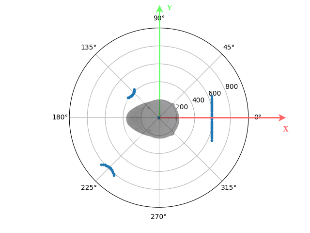

# LiDAR Scan

## Objetives
- Explore usage of [RPLIDAR A1](https://www.slamtec.com/en/lidar/a1) with a Python [library](https://github.com/adafruit/Adafruit_CircuitPython_RPLIDAR).
- Visualize LiDAR scan data.
- Polar and Cartesian coordinates conversion.

## Requirements
Place the LiDAR at designated location, start to scan and analyze the data.

### 1. (80%) LiDAR Scan Visualization
Complete [plot_scan.py](plot_scan.py) to achieve following requests.
1. (10%) Complete at least 1 successful scan in 360 degrees with 100+ non-zero distance samples. 
2. (20%) Plot the data points from last successful scan under the polar coordinate system. Only plot the data points within 0 to 1 meter range.
3. (10%) Save the plot as a image file (PNG or JPG) in this repository.
4. (40%) Log distance samples at 0, 135, and 225 degrees and the corresponding Cartesian coordinates under the frame set as shown in the figure below.
- Distance at 0 deg: ? m, Cartesian coordinates: (?, ?) m.
- Distance at 135 deg: ? m, Cartesian coordinates: (?, ?) m.
- Distance at 225 deg: ? m, Cartesian coordinates: (?, ?) m.

**Note:** The RPLIDAR A1 spins clockwise, but the polar plot use counter-clockwise as the default angle increasing direction. 
So, you may want to **reverse** the distance samples list when plot the data. 



#### Hints
- [Matplotlib](https://matplotlib.org/) installation
```console
# Run following line in terminal
pip install matplotlib --break-system-packages
```
- Polar plot [example](https://matplotlib.org/stable/gallery/pie_and_polar_charts/polar_demo.html)

### 2. (20%) Convert Polar coordinates to Cartesian coordinates 
Describe the conversion rule (from polar to Cartesian) using math language.
1. Please follow the frame setup shown in the figure above.
2. (10%) Define/Explain (4) symbols for general representations of (a pair of) polar coordinates and Cartesian coordinates.
3. (10%) About 2 equations are expected. 

## AI Policies
Please acknowledge AI's contributions follow the policies in the syllabus.
